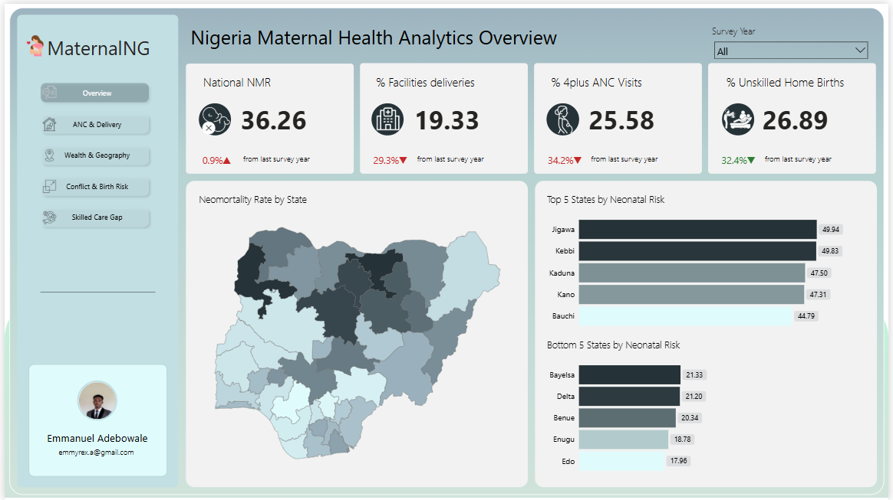
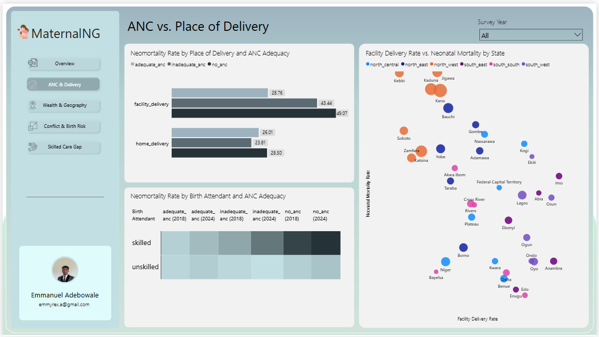
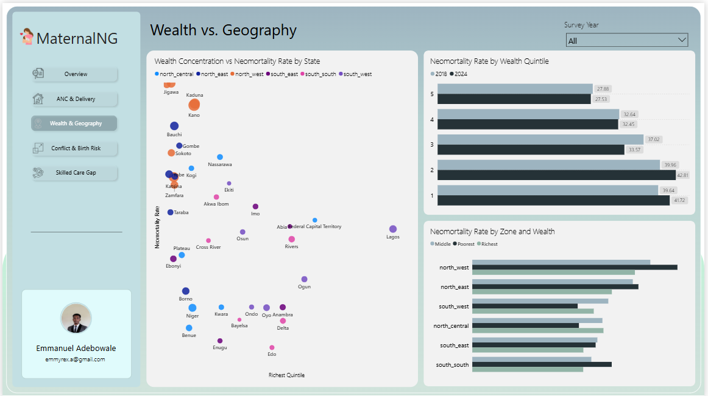
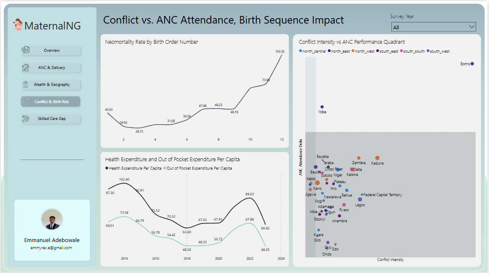
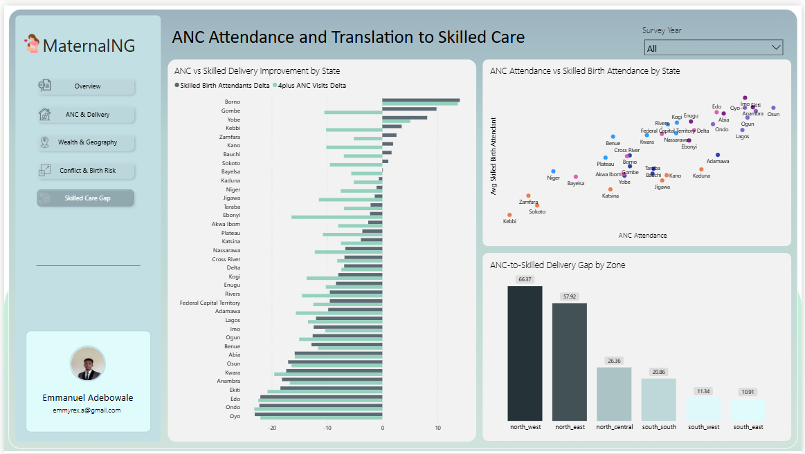

# Nigeria Maternal & Newborn Health Pipeline

A production-grade data pipeline analysing maternal and neonatal health outcomes 
across Nigeria's 37 states — built to answer five research questions using DHS 
survey data, ACLED conflict records, and World Bank health expenditure indicators.

---

## Why This Project Exists

Nigeria has the third highest maternal mortality rate in the world. Health policy 
is implemented at the state level, but the data infrastructure to support 
state-level decision-making has largely not existed in an accessible, analysable 
form. This project builds that infrastructure — from raw data ingestion to an 
analytical dashboard — and uses it to surface findings that complicate some common 
assumptions about what actually drives neonatal mortality.

---

## Dashboard


*Page 1: National overview — neonatal mortality rate, facility delivery coverage, 
and ANC attendance across Nigeria's 37 states.*


*Page 2: ANC attendance vs. place of delivery — predicting neonatal survival.*


*Page 3: Wealth as a lens on neonatal mortality across geopolitical zones.*


*Page 4: Conflict intensity, birth order, and ANC attendance trends.*


*Page 5: The gap between ANC attendance and skilled delivery by state and zone.*

---

## What It Found

- **ANC attendance predicts neonatal survival more strongly than place of 
delivery.** Facility NMR exceeds home delivery NMR across all ANC categories — 
consistent with emergency referral bias, not facility failure.
- **Wealth improves outcomes within every region, but geography sets the ceiling.** 
A wealthy woman in the North-West faces worse odds than a poor woman in the 
South-East.
- **Conflict does not straightforwardly suppress ANC attendance.** Borno and Yobe 
— the highest-conflict states — both improved ANC attendance between 2018 and 2024.
- **Most states show a gap between ANC attendance and skilled delivery.** Women are 
entering the care pathway but not completing it, particularly in the North-West and 
North-East.

---

## Stack

| Layer | Tool |
|---|---|
| Ingestion | Python |
| Raw Storage | Google Cloud Storage |
| Warehouse | BigQuery |
| Transformation | dbt Core |
| Orchestration | Apache Airflow (Docker Compose) |
| Serving | FastAPI |
| Visualisation | Power BI |

---

## Data Sources

- **DHS Nigeria** — 2018 and 2024 standard surveys (IR and BR files)
- **ACLED** — Conflict event data, 2015–present
- **World Bank API** — Health expenditure per capita, OOP expenditure, population

---

## Project Structure
maternal-health-pipeline/
├── assets/
│   ├── screenshots/        # Dashboard page screenshots
│   ├── report/             # PDF analytical write-up
│   └── maternal-health-pipeline.pbix
├── dags/                   # Airflow DAGs
├── ingestion/              # Python ingestion modules per source
├── dbt/                    # Staging, intermediate, and mart models
├── api/                    # FastAPI endpoints
├── seeds/                  # dim_state and dim_survey_period
└── findings_notes.md       # Key decisions and rationale

---

## Key Engineering Decisions

- **Aggregate-first modelling** — mart models are pre-aggregated at state and 
survey period grain, optimised for five fixed research questions rather than ad hoc 
flexibility
- **Weighted averages enforced end-to-end** — respondent-weighted measures in dbt 
and DAX prevent population-size distortion
- **Reliability flagging** — birth order NMR records classified as stable, reliable, 
or unreliable; unstable estimates excluded from visuals
- **FastAPI serving layer** — query logic centralised and versioned; dashboard 
decoupled from the warehouse
- **DHIS2 excluded deliberately** — access requires Ministry of Health credentials; 
documented as a finding about Nigeria's data infrastructure, not a project limitation

---

## Report

The full analytical write-up — findings per research question, engineering 
decisions, limitations, and recommendations — is available in 
[`assets/report/`](assets/Maternal_Health_Pipeline_Report/).

---

## Running the Pipeline

**Prerequisites:** Docker, Python 3.10+, GCP service account with BigQuery and GCS 
access, dbt Core
```bash
# Start Airflow
docker-compose up -d

# Airflow UI
http://localhost:8081

# Run FastAPI locally
uvicorn api.main:app --reload
```

Environment variables required:
- GOOGLE_APPLICATION_CREDENTIALS_LOCAL=path/to/key.json
- GOOGLE_APPLICATION_CREDENTIALS=path/to/key.json
- ACLED_API_KEY=your_key
